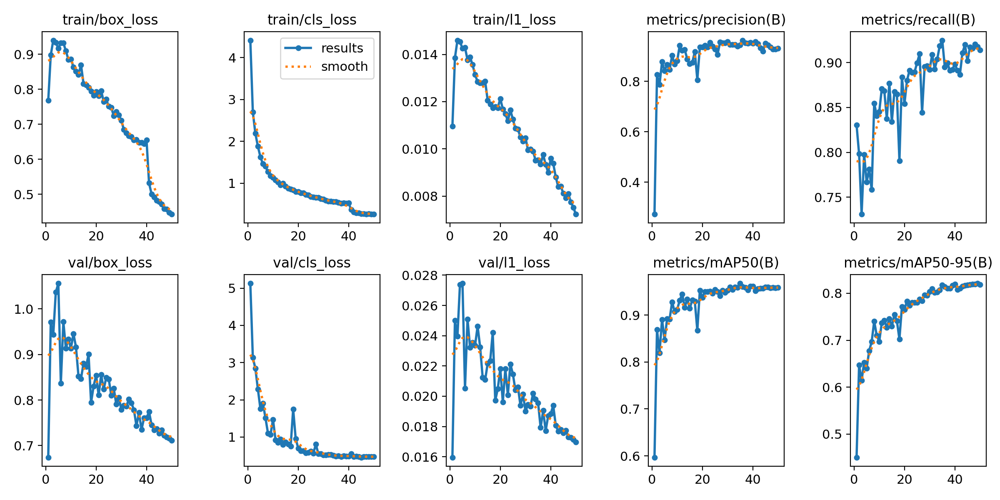
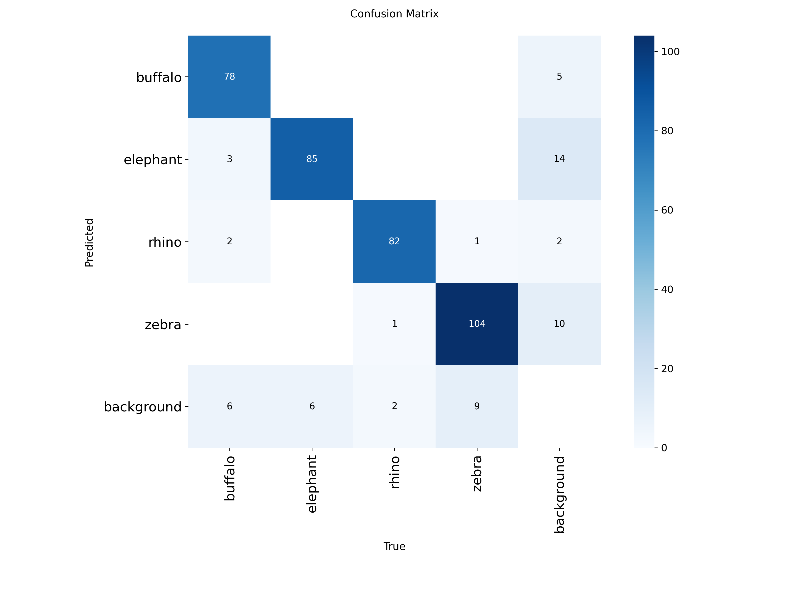
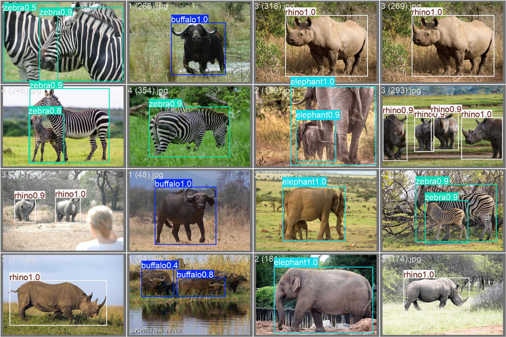

# Wildlife Detection with YOLO26

Object detection for African wildlife (buffalo, elephant, rhino, zebra). Two YOLO26 sizes were fine-tuned and compared on accuracy vs. speed, and the nano model, which matched the larger one's accuracy at about half the inference time, is served through a FastAPI endpoint that returns bounding boxes.


## Why

Classification tells you what is in an image; detection tells you what and where, and handles multiple objects per image. This project covers the detection side of deep learning, and tests a practical question: is the larger model worth its extra inference cost?

## Dataset

[African Wildlife](https://docs.ultralytics.com/datasets/detect/african-wildlife/) (original dataset by Bianca Ferreira, adapted for Ultralytics YOLO): 1,052 training images with bounding-box annotations for 4 classes. Downloaded automatically by Ultralytics on first training run.

## Approach

Both models start from COCO-pretrained weights and are fine-tuned on the wildlife dataset with identical settings (50 epochs, 640px images, batch size 16):

- **yolo26n** (nano): smallest and fastest
- **yolo26s** (small): larger, expected to be more accurate (it turned out to be only marginally so; see results)

Best weights (by validation mAP) from each run are used for evaluation, not the final epoch.

## Results

| Model | Precision | Recall | mAP50 | mAP50-95 | Inference (ms/img) |
|---|---|---|---|---|---|
| **yolo26n** | 0.921 | **0.924** | 0.958 | 0.820 | **3.57** |
| yolo26s | **0.935** | 0.912 | **0.964** | **0.825** | 6.36 |

Speed measured on a laptop RTX 4070.

**Per-class mAP50-95**

| Class | yolo26n | yolo26s |
|---|---|---|
| buffalo | 0.834 | 0.831 |
| elephant | 0.817 | 0.812 |
| rhino | 0.870 | 0.862 |
| zebra | 0.760 | 0.794 |

mAP50 is the average precision when a predicted box counts as correct at 50% overlap with the ground truth; mAP50-95 averages that over stricter thresholds from 50% to 95%, so it rewards tighter boxes.

### Which model is served, and why

**yolo26n.** The small model's accuracy lead is about half a point on both mAP metrics, which is within the run-to-run noise expected from a single training run on a validation set this size, while it costs roughly 1.8x the inference time (6.36 ms vs 3.57 ms). On this dataset the larger model isn't worth it.

The one clear exception is zebra, where the small model is 3.4 points ahead on mAP50-95. Zebra is also the hardest class for both models.

**Why zebra scores lowest on mAP50-95.** The confusion matrix shows zebra is rarely mistaken for another species (104 of 114 correct, almost no cross-class errors), so the lower score is unlikely to come from recognition. The likely cause is box placement. Zebras often stand in tight, overlapping herds, and in the demo image the least confident detections are all in the crowded group at the back. When animals overlap, the exact edges of each box are ambiguous, both for the model and for whoever drew the ground-truth labels. mAP50-95 averages accuracy over overlap thresholds up to 95%, so it penalises small box-placement differences that mAP50 forgives. The small model's larger lead on zebra (+0.034 mAP50-95) is consistent with this, since a bigger model may place boxes more precisely, but this was not tested directly.

Caveat: this is a single training run per model with one seed, so small differences shouldn't be over-read. Repeating each run with a few seeds would show how much of the gap is real.

## Training curves and errors



Training and validation losses fall together through all 50 epochs with no sign of overfitting, and mAP50-95 is still creeping upward at the end, so longer training might add a little.



The confusion matrix is computed at a confidence threshold of 0.25 (the mAP numbers above are computed across all thresholds). Overall recall is about 92% and precision about 90%. Wrong-class predictions are rare: only 7 of 379 labeled animals were mistaken for a different species. Most errors are about detection rather than identification: 23 animals were missed entirely and 31 boxes were drawn where nothing was labeled, with elephant producing the most of those false boxes (14).

## Example predictions



## API

**POST** `/detect?conf=0.25` with a multipart image upload (field name `file`)

```json
{
  "image_width": 1280,
  "image_height": 853,
  "inference_ms": 14.2,
  "detections": [
    { "class": "zebra", "confidence": 0.93, "box": [102, 220, 540, 700] }
  ]
}
```

`box` is `[x1, y1, x2, y2]` in pixels of the original image. `conf` is the minimum confidence for a detection to be returned.

## Run locally

```bash
git clone https://github.com/varun-aahil/wildlife-object-detection.git
cd wildlife-object-detection
pip install -r requirements.txt  
uvicorn main:app --reload
```

## Tech stack

Python, Ultralytics YOLO26, PyTorch, FastAPI, Pillow

## Limitations and next steps

- Only 4 classes and about 1,000 training images, so the model won't generalize to other species or to heavily cluttered scenes.
- Evaluated on the dataset's own validation split; images from real camera traps (night, motion blur, occlusion) would likely score lower.
- Next steps: add augmentation experiments, try a video endpoint, and export to ONNX to compare inference speed.